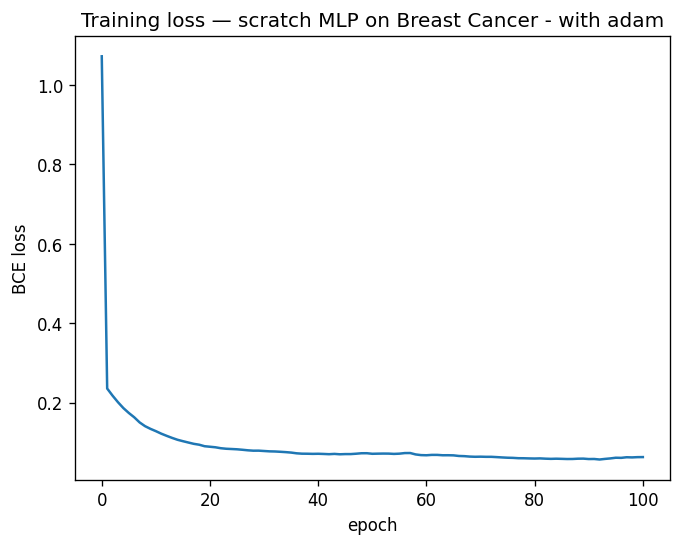

# micrograd-nick

A scalar autograd engine and 2-layer MLP, built from scratch in pure Python.
Trained on the Breast Cancer Wisconsin dataset. **95.6% test accuracy.**
Every gradient is verified against a numerical derivative to within `1e-9`.

## Why

I wanted to understand backpropagation by writing it, not by importing it or using any related library (of course it gonna slow down, but knowing a nature of a thing is very important).
The goal is not to beat any baseline — it's to prove I know what frameworks like PyTorch do under the hood.

## What's in here

- **`target.ipynb`** — Target score
- **`train.ipynb`** — Value, Neuron, Layer, MCP, BCE loss, full-batch SGD, training loop, model checkpointing.

## Architecture
Input(30) → Linear → tanh → Linear → sigmoid → ŷ
W₁(30×16)        W₂(16×1)

513 trainable parameters total.

## Results

| Model                              | Test accuracy |
|------------------------------------|--------------:|
| sklearn `LogisticRegression`       | 0.974         |
| sklearn `MLPClassifier(16,)`       | 0.974         |
| From-scratch scalar MLP | **0.956**     |
| From-scratch scalar MLP with Adam | **0.9737**     |

Similar to sklearn prob.

## Training

Full-batch gradient descent, learning rate 0.05, 100 epochs.

Steep descent from 1.07 to 0.12 in the first epoch, then gradually approach the global minimum.

**Final test accuracy: ~97.4%** (~ sklearn `MLPClassifier(16,)` at 97.4%).

## Writeup

Full derivation, gradient check methodology, and reflection:
**[PDF (Overleaf)](https://drive.google.com/file/d/1BIiF0u3THFnJ7ZPwhzEgMqz5sie7YpNB/view?usp=sharing)**

## What's next

- Vectorized version using NumPy arrays (~100× speedup, enables real datasets)
- PyTorch reimplementation with matched seeds, as an independent correctness check
- Same engine on a harder problem (e.g. Pima Diabetes, small image data)

## References

- Karpathy's [micrograd](https://github.com/karpathy/micrograd) — the lineage
- Andrew Ng's Deep Learning Specialization — Course 1, Week 3
- Glorot & Bengio (2010), *Understanding the difficulty of training deep feedforward neural networks* — Xavier init