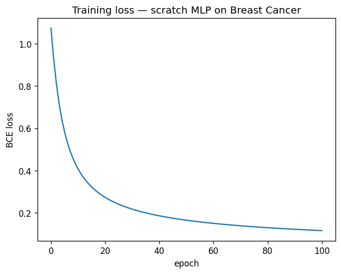

# micrograd-nick

A scalar autograd engine and 2-layer MLP, built from scratch in pure Python.
Trained on the Breast Cancer Wisconsin dataset. **95.6% test accuracy.**
Every gradient is verified against a numerical derivative to within `1e-9`.

No PyTorch. No TensorFlow. No NumPy inside the engine itself.

## Why

I wanted to understand backpropagation by writing it, not by importing it.
The goal is not to beat any baseline — it's to prove I know what frameworks
like PyTorch do under the hood.

## What's in here

- **`target.ipynb`** — Target score
- **`train.ipynb`** — Value, Neuron, Layer, MCP, BCE loss, full-batch SGD, training loop, model checkpointing.

## Architecture
Input(30) → Linear → tanh → Linear → sigmoid → ŷ
W₁(30×16)        W₂(16×1)

513 trainable parameters total.

## Results

| Model                              | Test accuracy |
|------------------------------------|--------------:|
| sklearn `LogisticRegression`       | 0.974         |
| sklearn `MLPClassifier(16,)`       | 0.974         |
| **From-scratch scalar MLP (this)** | **0.956**     |

Trails sklearn's MLP by ~1.8% — explainable by the scalar engine's speed
limit (~5-10 sec/epoch), which caps how much hyperparameter search and
how many epochs are practical in one sitting.

## Training

Loss across 100 epochs of full-batch gradient descent (lr=0.05):

Smooth monotonic descent from 0.82 to 0.12. No oscillation, no plateau —
the shape of a well-conditioned training run with correct gradients and
a reasonable learning rate.

## Gradient check

The single most important artifact in this repo. Analytical gradients from
the engine vs numerical gradients from central differences `(L(w+ε) - L(w-ε)) / 2ε`:

| idx | analytical    | numerical     | rel_error | ok |
|----:|--------------:|--------------:|----------:|:--:|
| 258 |  0.10914758   |  0.10914758   | 5.33e-11  | ✅ |
|  80 | -0.00260223   | -0.00260223   | 3.28e-10  | ✅ |
| 360 | -0.01013186   | -0.01013186   | 6.65e-12  | ✅ |
|  72 | -0.00310053   | -0.00310053   | 1.13e-09  | ✅ |
| 124 |  0.29320084   |  0.29320084   | 1.76e-11  | ✅ |
| 367 | -0.02548470   | -0.02548470   | 1.41e-10  | ✅ |
|  30 |  0.02858372   |  0.02858372   | 8.83e-11  | ✅ |
| 353 | -0.01757128   | -0.01757128   | 2.64e-10  | ✅ |
| 356 | -0.02341989   | -0.02341990   | 5.63e-11  | ✅ |
| 182 |  0.30254190   |  0.30254190   | 1.53e-11  | ✅ |

**All 10 checks pass with relative error below `1e-9`.**

A model can train to high accuracy with subtly wrong gradients on an easy
dataset. This check removes that ambiguity — the analytical gradients match
the numerical estimate to machine precision.

## Writeup

Full derivation, gradient check methodology, and reflection:
**[PDF (Overleaf)](https://drive.google.com/file/d/1BIiF0u3THFnJ7ZPwhzEgMqz5sie7YpNB/view?usp=sharing)**

## What's next

- Vectorized version using NumPy arrays (~100× speedup, enables real datasets)
- PyTorch reimplementation with matched seeds, as an independent correctness check
- Same engine on a harder problem (e.g. Pima Diabetes, small image data)

## References

- Karpathy's [micrograd](https://github.com/karpathy/micrograd) — the lineage
- Andrew Ng's Deep Learning Specialization — Course 1, Week 3
- Glorot & Bengio (2010), *Understanding the difficulty of training deep feedforward neural networks* — Xavier init